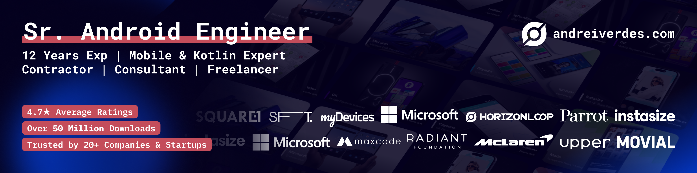
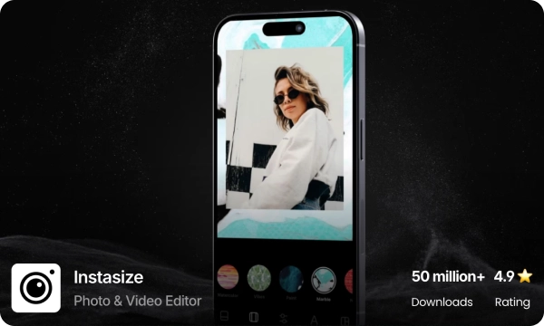
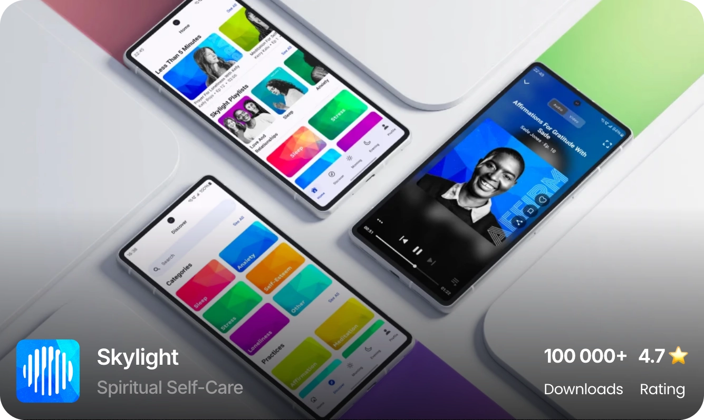
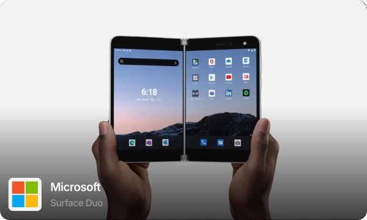
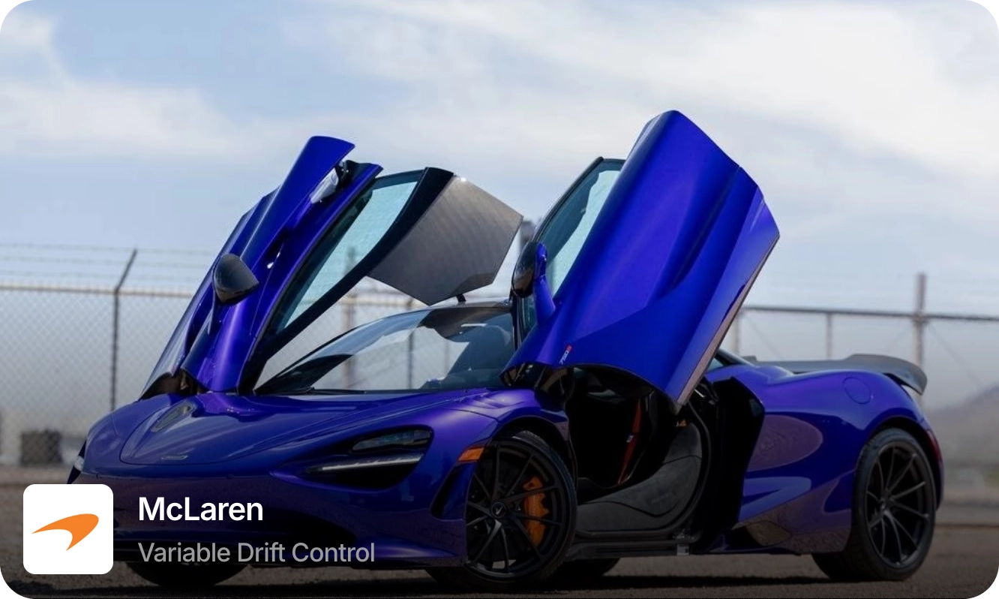
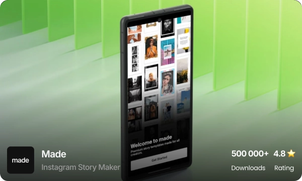
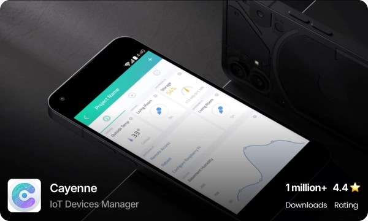
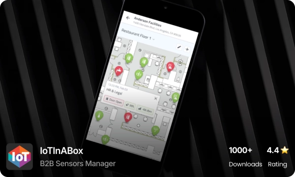
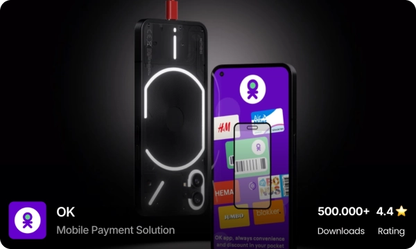

<!--
**andreiverdes/andreiverdes** is a ✨ _special_ ✨ repository because its `README.md` (this file) appears on your GitHub profile.

Here are some ideas to get you started:

- 🔭 I’m currently working on ...
- 🌱 I’m currently learning ...
- 👯 I’m looking to collaborate on ...
- 🤔 I’m looking for help with ...
- 💬 Ask me about ...
- 📫 How to reach me: ...
- 😄 Pronouns: ...
- ⚡ Fun fact: ...

**🌍 Location:** Romania  
**🕒 Time Zone Compatibility:** 4 hrs overlap (PST or EST)  
**💼 Experience:** 13 years  

[**🌐 andreiverdes.com**](https://andreiverdes.com)

---
-->

[**🌐☝️ andreiverdes.com**](https://andreiverdes.com)
## About Me

With over **12 years of experience** (including **8 years working remotely**) across fields such as **Mobile Payments, IoT, Automotive, Photo/Video Processing, Digital Wellbeing**, and more, I have proudly built and maintained successful apps from the ground up, achieving **over 50 million downloads** and an **average rating of 4.6 stars** for clients across the **USA and Europe**.

---
[link-instasize]: https://andreiverdes.com/projects/instasize-media-editor

## My Work
|  | ![[link-instasize]](./art/projects/instasize.webp)([link-instasize]) |  |
|----------|----------|----------|
|    |  |  |
|    |  |  |

---

## Skills

  Android
  Android SDK
  Kotlin
  Framer
  Material Design
  Jetpack Compose
  Clean Architecture
  MVI
  MVP
  MVVM
  MVC
  Open AI APIs
  Gradle
  Dagger2
  Java
  Hilt
  OpenGL/ES
  GLSL
  RxJava
  Kotlin Flows
  Kotlin Coroutines
  Analytics
  Continuous Delivery
  Continuous Integration
  AOSP
  Firebase Services
  A/B Testing
  PlayStore Publishing/Release

---

## Contact

📧 **Email:** [your.email@example.com](mailto:your.email@example.com)  
🔗 **LinkedIn:** [linkedin.com/in/your-profile](https://linkedin.com/in/your-profile)  
💼 **Portfolio:** [andreiverdes.com](https://andreiverdes.com)
